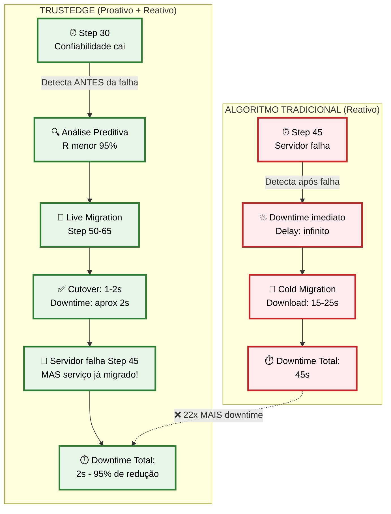

```mermaid
graph TB
    subgraph "ALGORITMO TRADICIONAL (Reativo)"
        direction LR
        T1[⏰ Step 45<br/>Servidor falha] -->|"Detecta após falha"| T2[💥 Downtime imediato<br/>Delay: infinito]
        T2 --> T3[🔄 Cold Migration<br/>Download: 15-25s]
        T3 --> T4[⏱️ Downtime Total:<br/>45s]
    end
    
    subgraph "TRUSTEDGE (Proativo + Reativo)"
        direction LR
        TE1[⏰ Step 30<br/>Confiabilidade cai] -->|"Detecta ANTES da falha"| TE2[🔍 Análise Preditiva<br/>R menor 95%]
        TE2 --> TE3[🔄 Live Migration<br/>Step 50-65]
        TE3 --> TE4[✅ Cutover: 1-2s<br/>Downtime: aprox 2s]
        TE4 --> TE5[💾 Servidor falha Step 45<br/>MAS serviço já migrado!]
        TE5 --> TE6[⏱️ Downtime Total:<br/>2s - 95% de redução]
    end
    
    %% Comparação
    T4 -.->|"❌ 22x MAIS downtime"| TE6
    
    %% Estilos
    classDef traditional fill:#ffebee,stroke:#c62828,stroke-width:3px,color:#000
    classDef trustedge fill:#e8f5e9,stroke:#2e7d32,stroke-width:3px,color:#000
    classDef comparison fill:#fff3e0,stroke:#ef6c00,stroke-width:2px,color:#000
    
    class T1,T2,T3,T4 traditional
    class TE1,TE2,TE3,TE4,TE5,TE6 trustedge
```